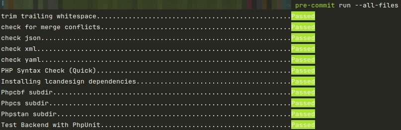
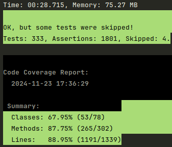
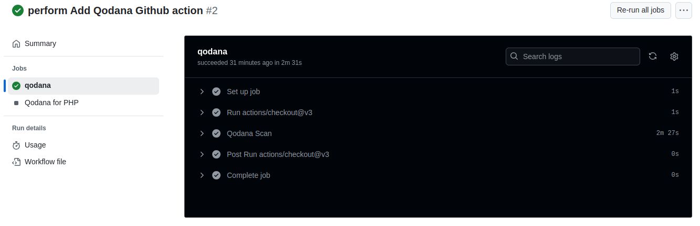
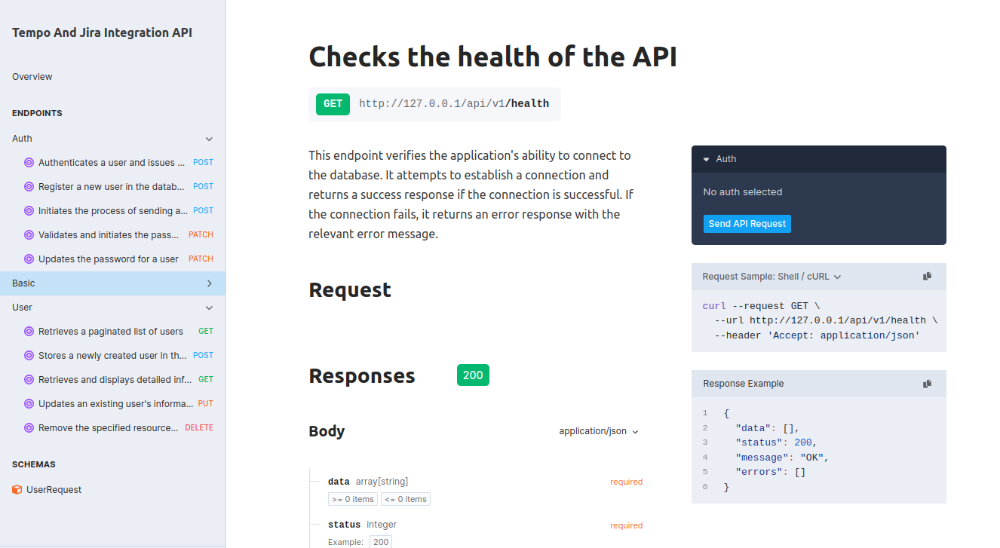

## Jira :tanabata_tree: and Tempo :timer_clock: integration API
This Laravel application is designed to integrate seamlessly with the [Tempo](https://apidocs.tempo.io/) and
[Jira](https://developer.atlassian.com/cloud/jira/platform/rest/v3/intro/#version) APIs.
It facilitates the synchronization of project management data, allowing users to efficiently manage their tasks, track time,
and gain insights through combined data from Tempo and Jira. The application adheres to clean code principles,
utilizes SOLID design patterns, and is built with modularity and scalability in mind.


## Table of Contents

- [Prerequisites](#prerequisites)
- [Project Setup](#project-setup)
- [Pre Commit Configuration](#pre-commit-configuration)
- [Run Tests](#run-tests)
- [GitHub Actions](#github-actions)
- [Documentation](#documentation)
- [Troubleshooting](#troubleshooting)


## Prerequisites

Before you begin, ensure you have the following installed on your local machine:

- [Docker](https://www.docker.com/get-started)
- [Docker Compose](https://docs.docker.com/compose/install/)
- [Git](https://git-scm.com/)

You have needed the next ports available:

- 80
- 3306
- 9000
- 6379

## Project Setup

### If you need create an API with Laravel 11 or upper, run the next command:
```bash
docker-compose run --rm artisan install:api
```
That command create and integration with sanctum library and create the `routes/api` the latter is necessary for our project.

I prefer remove sanctum and use jwt. **To do this, these are the steps**:

1. Remove to sanctum library from our `composer.json` file.

2. Remove the `santum.php` file.

3. Update our composer libraries:
   ```bash
    docker-compose run --rm composer update
   ```

   ```bash
    docker-compose run --rm composer dump-autoload
   ```

4. To install [JWT](https://jwt-auth.readthedocs.io/en/develop/laravel-installation/). Run these commands:
   ```bash
    docker-compose run --rm composer require tymon/jwt-auth
   ```

5. Publish the JWT config:
   ```bash
    docker-compose run --rm artisan vendor:publish --provider="Tymon\JWTAuth\Providers\LaravelServiceProvider"
   ```

6. Create the JWT secret with this command:
   ```bash
    docker-compose run --rm artisan jwt:secret
   ```

7. Run the migrations and seeders:
   ```bash
    docker-compose run --rm artisan migrate:fresh --seed
   ```

### Pre Commit Configuration
I'm ussing [pre-commit framework](https://pre-commit.com/index.html) to have good practices and unified estandard.

1. You can install the tool in ubuntu distribution using the next command::
    ```bash
    sudo apt install pre-commit
    ```

    Or using Python with the next command:
    ```bash
    pip install pre-commit
    ```

    Validated the correct instalation, run this command:
    ```bash
    pre-commit --version
    ```

   The result have been similar to:
    ```text
    pre-commit 2.17.0
    ```

2. Now you need install the hooks, with this command:
    ```bash
    pre-commit install
    ```

3. To run manually you can execute this command in the `src` path:
    ```bash
    pre-commit run --all-files
    ```

    **Now the hooks validate the next items:**

    - Trim trailing whitespace :heavy_check_mark:
    - Check for merge conflicts :heavy_check_mark:
    - Check JSON format :heavy_check_mark:
    - Check XML format :heavy_check_mark:
    - Check Yaml format :heavy_check_mark:
    - PHP Syntax Check (Quick) :heavy_check_mark:
    - Php CodeSniffer Standard PSR12 :heavy_check_mark:
    - Autofix standard PSR12 with phpcbf :heavy_check_mark:
    - PhpStan with level rule in 4 :heavy_check_mark:
    - PhpUnit :heavy_check_mark:

    

### Run Tests

To run the tests, execute the next command:
```bash
docker-compose run --rm artisan test
```



### GitHub Actions

All push to the main branch, will need to pass the [Qodana scan](https://www.jetbrains.com/help/qodana/getting-started.html).
Apply to the Pull Request too.


### Documentation
This API use Swagger specifically this [library](https://scramble.dedoc.co/). To see the documentation,
go to this [URL](http://127.0.0.1/docs/api).

To validate the documentation, run the next command:
```bash
docker-compose run --rm artisan scramble:analyze
```



### Troubleshooting
If you want to make a backup of your database, run the next commands:
```bash
mysqldump -ulcandelario -p --lock-tables=false tempo_and_jira > tempo_and_jira.sql
```
Where:
- `lcandelario` is your username
- `--lock-tables=false` is your options
- `tempo_and_jira` is your database name
- `tempo_and_jira.sql` is your output file name

**If you have this error:**
```text
mysqldump: Error: 'Access denied; you need (at least one of) the PROCESS privilege(s) for this operation' when trying to dump tablespaces
```

Run the next commands inside the database container by default `tempo_and_jira_db`:
```bash
docker exec -it tempo_and_jira_db sh
mysql -u root -proot_password
GRANT RELOAD ON *.* TO 'lcandelario'@'%';
GRANT PROCESS ON *.* TO 'lcandelario'@'%';
FLUSH PRIVILEGES;
SHOW GRANTS FOR 'lcandelario'@'%';
```

Run again the dump command to create the backup and copy it to your desktop:
```bash
mysqldump -ulcandelario -p --lock-tables=false tempo_and_jira > tempo_and_jira.sql
```

Run the next command outside the database container, to copy it to your desktop:
```bash
docker cp tempo_and_jira_db:/tempo_and_jira.sql /home/lcandelario/Desktop/tempo_and_jira.sql
```
---
